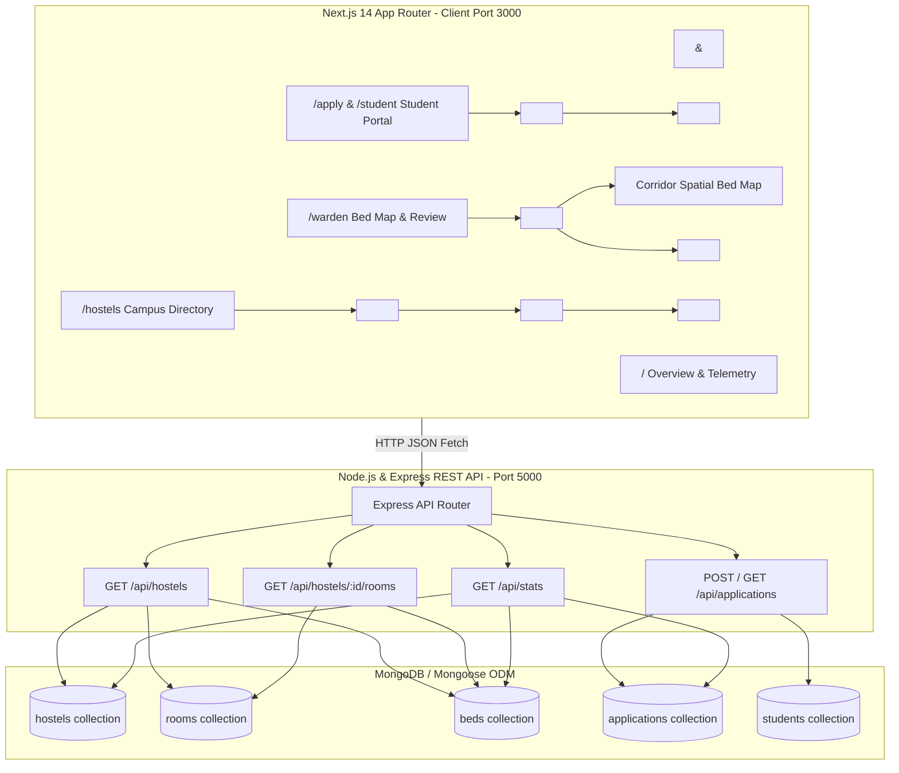

# Policy-Driven Hostel Room Allocation Engine

> **Academic Session 2026–2027 Residential Housing Management Platform**  
> **FOUNDATION EVALUATION & ARCHITECTURE REVIEW (25 MARKS)**  
> Target Stage-Gate Status: **GREEN — On Track**

---

## 1. Foundation Evaluation Alignment Matrix (25 Marks)

| Parameter | Marks | Teacher Checks (Rubric Requirements) | Minimum Evidence in This Project | Project Implementation & Verification |
| :--- | :---: | :--- | :--- | :--- |
| **1. Architecture & Design** | **5** | • Clear decomposition into functional React components with sensible responsibility boundaries.<br>• Avoids a single monolithic component.<br>• Data entities, user roles and major workflows identified.<br>• Basic state/data-flow decisions justified; immutability respected. | Component tree + architecture diagram + repo structure | • Modular React components: `Navbar`, `DemoBanner`, `Footer`, `PreferenceRanker`, `ApplicationForm`, `WardenDashboard`, `AllocationTable`, `HostelCard`, `HostelList`, `RoomCard`, `BedGrid`, `StatusBadge`, `SkeletonLoader`.<br>• User roles: Student, Warden, Administrator.<br>• Immutability respected via React state hooks. |
| **2. React.js Routing & Implementation** | **5** | • Application starts and renders correctly.<br>• Core pages/views implemented using React components & JSX.<br>• Navigation/routing structure planned or partially implemented.<br>• Props, component composition & conditional rendering used meaningfully. | Running app + page/navigation demonstration | • Next.js 14 App Router: `/` (Overview), `/apply` & `/student` (Student Portal), `/warden` (Warden Bed Map & Review), `/hostels` (Inventory Directory).<br>• Clean component composition and prop drilling with defaults.<br>• Conditional rendering for loading skeletons, vacancy status, and role-based views. |
| **3. Rendering / Data Fetching** | **5** | • Core UI renders project data or realistic seed/mock data.<br>• Data-fetching approach identified & at least one representative interaction demonstrated.<br>• Loading/empty/error states considered where relevant.<br>• No hard-coded UI-only prototype where dynamic behaviour is expected. | Working screen + data/state evidence | • Dynamic client/server data fetching via REST API: `GET /api/hostels`, `GET /api/applications`, `GET /api/stats`.<br>• Interactive preference ranking toggles, room configuration pills, live capacity bars, and instant local state synchronization.<br>• Fallback graceful states and skeleton loaders. |
| **4. Initial Backend & Database** | **3** | • Backend/API architecture defined for projects requiring persistence.<br>• Core entities/schema or data model documented.<br>• Minimal endpoint / database connection demonstrated.<br>• Explanation of how React communicates with server. | ER/data model + endpoint/schema/mock integration | • Express REST server running on port `5000` with CORS & rewrite proxy.<br>• In-memory MongoDB database auto-seeded with 4 Hostels, 72 Beds, and 5 Applications.<br>• Mongoose schemas for `Hostel`, `Block`, `Room`, `Bed`, `Student`, `Application`, `AllocationDraft`.<br>• Next.js communicates via HTTP `fetch` to Express REST endpoints. |
| **5. Product Workflow** | **3** | • End-to-end primary user journey mapped.<br>• Roles and responsibilities reflected in design.<br>• At least one critical workflow clickable/demonstrable.<br>• Proposed implementation aligned with institutional problem. | Primary workflow walkthrough | • **Clickable End-to-End Workflow**: Student browses hostels → Selects & prioritizes ranked choices → Configures roommate roll pairing → Submits application → Application immediately updates in Warden review dashboard → Warden audits spatial bed map, checks compatibility, and verifies applicant. |
| **6. Documentation** | **4** | • Problem statement, objectives and scope documented.<br>• Architecture / workflow diagram available.<br>• Feature backlog / module plan identifies what will be completed in Phase 2 and Phase 3.<br>• Setup/run instructions and team responsibilities. | README + backlog / milestone plan | • Comprehensive `README.md` and `docs/architecture.md`.<br>• System architecture & ER diagram.<br>• Clear Phase 2 & Phase 3 milestone backlog.<br>• Single-command run instruction (`npm run dev`). |
| **TOTAL** | **25** | | | **Decision Target: GREEN — On Track** |

---

## 2. Problem Statement & Scope

### Institutional Context
Hostel room allocation in collegiate institutions is conventionally conducted via paper queues or static spreadsheets. This leads to:
1. **Lack of Transparency**: Students cannot view actual bed-level vacancies, AC/Non-AC status, or floor accessibility before submitting applications.
2. **Roommate Mismatches**: Non-consensual assignments lead to roommate lifestyle friction and administrative room-swap burdens.
3. **Manual Administrative Bottlenecks**: Wardens spend weeks cross-referencing eligibility, CGPA rankings, and special medical accommodations.

### Objectives
- **Phase 1 (Foundation Review — Current)**: Establish the complete UI/UX foundation, component decomposition, Next.js routing, REST API communication, in-memory database connectivity, and the primary student-to-warden workflow.
- **Phase 2 (Milestone 2)**: Implement the deterministic constraint solver algorithm with roommate lifestyle compatibility scoring.
- **Phase 3 (Milestone 3)**: Finalize digital allotment letter generation with cryptographic QR verification, payment fee receipt integration, and analytics.

---

## 3. Component Tree & Decomposition

```
<RootLayout>
 ├── <DemoBanner />                     [Alert banner for evaluation review]
 ├── <Navbar>                           [Header, Logo, Pill Nav, Persona Switcher]
 ├── <Main>
 │    ├── Route: / (Overview)
 │    │    ├── Hero Section             [Dark campus hero, shimmer headline, CTAs]
 │    │    ├── Telemetry Stats Bar      [Pulsing live radar dot, 4 stat metric cards]
 │    │    └── Campus Infrastructure    [Residential hall cards (BH1-BH6, GH1-GH4)]
 │    │
 │    ├── Route: /apply & /student (Student Portal)
 │    │    ├── Student Profile Header   [Roll number, CGPA, department, distance]
 │    │    ├── Status Alert Banner      [Eligibility badge, criteria breakdown]
 │    │    ├── Step Navigation Tabs     [Preferences, Lifestyle, Matchmaker, Swap]
 │    │    └── <ApplicationForm>
 │    │         ├── <PreferenceRanker>  [Ranked residence cards, room config pills]
 │    │         ├── Mutual Roommate Input
 │    │         └── Corridor Checkboxes (Quiet Zone, Ground Floor Accessible)
 │    │
 │    ├── Route: /warden (Warden Governance)
 │    │    └── <WardenDashboard>
 │    │         ├── Review Header       [Draft cycle badge, Approve & Publish CTAs]
 │    │         ├── Hostel & Floor Selector [Pill buttons: BH1, GH1, Ground Floor]
 │    │         ├── Corridor Bed Map    [Room cards, Bed A/B cards, Vacant slots]
 │    │         └── <AllocationTable>   [Search, status filter pills, student detail modal]
 │    │
 │    └── Route: /hostels (Inventory)
 │         └── <HostelList>
 │              ├── <HostelCard>        [Hall capacity bar, amenity badges, CTA]
 │              └── Room Inspection Modal
 │                   └── <RoomCard>
 │                        └── <BedGrid> [Bed slot availability visualizer]
 └── <Footer>                           [4-column institutional footer, DSW Secretariat, Helplines]
```

---

## 4. System Architecture Diagram



---

## 5. End-to-End Primary Workflow Walkthrough

1. **Step 1: Browse Hostels (`/hostels`)**
   - Student inspects available halls by gender filter (Boys, Girls, Co-ed).
   - Clicks *"Explore Rooms & Beds"* to view floor-level room types and vacant bed slots.
2. **Step 2: Submit Ranked Preferences (`/apply` or `/student`)**
   - Student profile (Arjun Patel, 2024CS101, CGPA 8.90) is pre-loaded.
   - Clicks residential cards to toggle priority rankings (`Choice 1: BH1`, `Choice 2: BH2`).
   - Selects room configurations (`DOUBLE AC`, `SINGLE AC`).
   - Enters mutual roommate roll number (`2024CS102` for Rohan Verma) and selects corridor preferences.
   - Clicks *"Save Preferences"*; data is transmitted over HTTP POST to the backend.
3. **Step 3: Warden Audit & Review (`/warden`)**
   - Warden accesses the station, views cycle status (`Cycle: Draft (Pre-Review)`).
   - Inspects the visual corridor bed map (BH1 Ground Floor) to review resident roommate compatibility percentages (`80% Compatibility`, `100% Compatibility`).
   - Audits the applicant queue table, filters by status (`SUBMITTED`, `UNDER_REVIEW`, `ALLOCATED`), inspects special accommodation requests, and authorizes status.
   - Clicks *"Approve Draft"* or *"Publish"* to lock the allocation cycle.

---

## 6. Milestone Backlog: Week 9 & Week 13 Roadmap

### Week 9 Milestone — Constraint Solver & Roommate Matching
- [ ] Implement deterministic Gale-Shapley / Integer Linear Programming constraint allocation engine.
- [ ] Incorporate composite merit score calculation: $\text{Score} = (0.6 \times \text{CGPA}) + (0.4 \times \text{Distance Score})$.
- [ ] Calculate Euclidean lifestyle compatibility vectors from sleep, study, and social habit surveys.
- [ ] Automatic mutual pairing resolution when both students reference each other's roll number.

### Week 13 Milestone — Institutional Governance, Letters & Audit
- [ ] Dynamic PDF Allotment Letter generation with verifiable HMAC cryptographic QR verification (`/verify`).
- [ ] Peer-to-peer room swap authorization workflow with mutual warden sign-off.
- [ ] DSW Executive Analytics Dashboard (`/analytics`) tracking hostel occupancy rates, demographic distributions, and quota utilization.
- [ ] Role-based access control (RBAC) integration with institutional SSO / LDAP authentication.

---

## 7. Setup & Run Instructions

### Prerequisites
- Node.js 18+ or 20+
- npm 9+

### Quick Start (Single Command)
Clone the repository and install dependencies:
```bash
npm install
```

Start both the **Next.js Frontend** (`:3000`) and the **Express Backend** (`:5000`) concurrently:
```bash
npm run dev
```

### Individual Service Commands
- **Run Frontend only**: `npm run dev:client` (Starts on `http://localhost:3000`)
- **Run Backend only**: `npm run dev:server` (Starts on `http://localhost:5000`)
- **Seed Database**: `npm run seed`

### Port Summary
- Frontend: `http://localhost:3000`
- Backend API: `http://localhost:5000`
- API Health Check: `http://localhost:5000/api/health`

---

## 8. Team Roles & Responsibilities

- **Frontend & UI/UX Architecture**: Next.js App Router structure, component decomposition (`PreferenceRanker`, `BedGrid`, `AllocationTable`), responsive design system, and accessibility tokens.
- **Backend & Database Engineering**: Express REST API endpoints, Mongoose schema modeling (`Hostel`, `Room`, `Bed`, `Application`), automated database seeding, and connectivity.
- **System Integration & Testing**: API rewrites, end-to-end user journey validation, and evaluation documentation.
