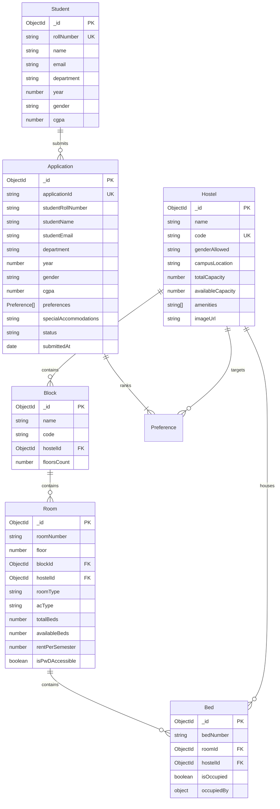

# System Architecture & Component Design

## 1. Component Hierarchy & Decomposition

The frontend is strictly decomposed into functional React components with clear responsibility boundaries:

```
App (RootLayout)
 +-- Navbar
 �    +-- RoleSwitcher (Student / Warden / Administrator)
 +-- Routes
 �    +-- / (HomePage)
 �    �    +-- HeroSection
 �    �    +-- ArchitecturePillars
 �    �    +-- WorkflowTimeline
 �    �    +-- PortalSelectionCards
 �    �
 �    +-- /hostels (HostelsPage)
 �    �    +-- FilterToolbar (Gender, Search)
 �    �    +-- SkeletonLoader (Loading State)
 �    �    +-- HostelList
 �    �         +-- HostelCard (Capacity Meter, Amenities, Image)
 �    �         +-- Room Inspection Modal
 �    �              +-- RoomCard
 �    �                   +-- BedGrid (Interactive Bed Slot Map)
 �    �
 �    +-- /apply (ApplyPage)
 �    �    +-- ApplicationForm
 �    �         +-- StudentProfileFields (Roll, Name, CGPA, Dept, Year)
 �    �         +-- PreferenceRanker (Drag/Up-Down Priority Order 1st, 2nd, 3rd)
 �    �         +-- AccommodationsNote
 �    �         +-- SubmissionReceipt (Application ID, Status, Verification)
 �    �
 �    +-- /warden (WardenPage)
 �         +-- WardenDashboard
 �              +-- MetricCounters (Capacity, Occupancy %, Queue Size)
 �              +-- EngineNotice (Policy Engine Solver Roadmap)
 �              +-- AllocationTable
 �                   +-- StatusFilterToolbar
 �                   +-- SearchInput
 �                   +-- StatusBadge (Pill Micro-component)
 �                   +-- ApplicationInspectionModal (Review & Status Transition)
 +-- Footer
```

---

## 2. Entity-Relationship Data Model (ERD)



---

## 3. State & Data-Flow Architectural Decisions

| Concern | Pattern | Rationale |
| :--- | :--- | :--- |
| **Server State (Hostels, Rooms, Beds)** | Fetched via REST API (`/api/hostels`, `/api/hostels/:id/rooms`) | Single source of truth in MongoDB. Eliminates client-side data staleness and supports real-time bed availability queries. |
| **Warden Queue State** | Dynamic fetch (`/api/applications`, `/api/stats`) with live PATCH mutation | Enables wardens to review student applications, update workflow state (`UNDER_REVIEW` ? `ALLOCATED`), and recalculate dashboard counters. |
| **Preference Ranking State** | Local React component state (`PreferenceRanker`) | Low latency, highly responsive reordering (1st, 2nd, 3rd choice). Only sent over network when the student completes validation and submits the entire application. |
| **Role & Session Context** | `localStorage` backed React state (`RoleSwitcher`) | Enables zero-friction switching between **Student** (applicant) and **Warden** (administrator) viewports during demonstrations without complex auth ceremony. |
| **Form Inputs & Wizard** | Controlled component state (`ApplicationForm`) | Instant feedback, validation, and optimistic receipt rendering upon HTTP 201 response. |

---

## 4. Next.js to Express API Communication Pattern

- **Base URL**: `http://localhost:5000` (or routed seamlessly through Next.js rewrite proxy at `/api/:path*`).
- **Protocol**: Standard REST over HTTP JSON (`fetch(url, { headers: { 'Content-Type': 'application/json' } })`).
- **Error Handling**: Every endpoint returns `{ success: boolean, data?: any, message?: string }`. Frontend displays error states and provides retry handlers.
